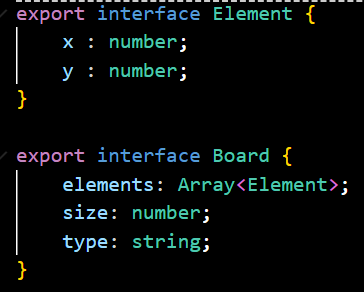
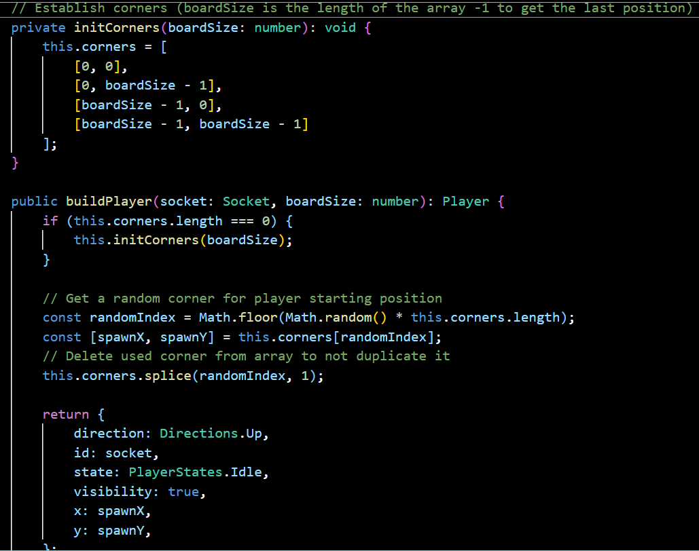
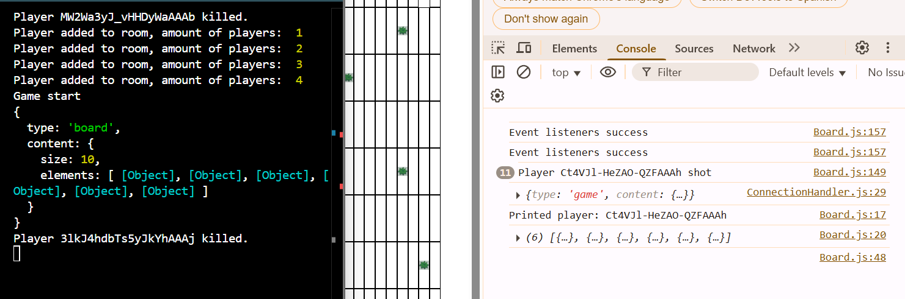

# Proyecto final de trimestre (Tamagochis Cxbrxnxs)

## Explicación del proyecto
El proyecto es un juego multijugador de cuatro jugadores que empiezan cada uno en una esquina de un tablero NxN.
Tiene que haber 3 botones; 'Move' para poder desplazar al jugador una casilla en la dirección en la que está mirando, 'Rotate' para girar al jugador 45º en sentido de las agujas del reloj y 'Shoot' para disparar a la casilla que tiene en frente de la dirección en la que está mirando el jugador.
Hay arbustos en el tablero que no puede estar un arbusto colcoado en el perímetro de otro arusto. Son usados para que los jugadores se esconda

## Diseño del Tablero y Mecánicas de Juego  
### Implementación de un tablero de tamaño NxN correctamente generado
- En el lado del servidor: 
    <a href="./server/src/game/entities/Board.ts">Board.ts</a>
    Board.ts define las interfaces que representan el tablero en el servidor.
    Define la estructura; *size: number* (tamaño N), *elements: Array de Element*(lista de objetos, como los jugadores o arbustos con sus coordenadas) y *type: string* (haciendo que el tablero sea un string).
    
    
    <a href="./server/src/game/BoardBuilder.ts">BoardBuilder.ts</a>    
    BoardBuilder.ts construye el tablero en el servidor.
    Inicializa el objeto *board* (definiendo su tamaño a 10x10), *elements: []* (para los arbustos y jugadores) y *type: "board"* 
    Usa un array/matriz llamado *map* que representa la posición de los arbustos.
    
- En el lado del cliente:
    <a href="./cliente/src/entities/Board.js">Board.js</a>
    Board.js muestra el tablero en el navegador y lo actualiza cuando cambia el estado de juego.
    Recibe datos del servidor y contruye un array de 
    juego. La función *print()* generea el array vacío y añade los *elements* (jugadores y arbustos).
    La función *printInHtml()* crea el html y asigna el css a los jugadores, arbustos y botones usando *document.createElement*. 

### Configuración inicial de los jugadores en las esquinas del tablero
- En el lado del servidor: 
    <a href="./server/src/game/GameService.ts">GameService.ts</a>
    GameService.ts se encarga definir las esquinas con *initCorners()* y de colocar a los jugadores en las esquinas del tablero con la función *buildPlayer()*. 
    

### Implementación de ataques entre jugadores con reglas de distancia. 
- En el lado del servidor
	<a href="./server/src/game/GameService.ts">GameService.ts</a>
	GameService.ts se encarga de que el disparo solo mate a un jugador cuando esté en la 	casilla de enfrente de la dirección del jugador que dispara, con la función *shootPlayer()*, además comprueba que la casilla a la que dispara esté localizada en el tablero y si hay un jugador en dicha casilla a la que va a disparar.
	

	Problema encontrado, no he conseguido hacer que desaparezca el jugador muerto del tablero, el servidor recibe el mensaje de que se ha muerto, pero sigue visible en el tablero, y le cambio el estado a *Dead*.

### Implementación de casillas de escondite con normas de posicionamiento adecuadas. 
- En el lado del servidor
	<a href="./server/src/game/BoardBuilder.ts">BoardBuilder.ts</a>
	BoardBuilder.js determina el posicionamiento de los arbustos con el array/matriz 	demostrado anteriormente, representándolos con el número 5 que es impseo en el lado del servidor con ese mismo valor.
	

### Cómo se ve en el navegador

### Comunicación Cliente-Servidor con WebSockets  
- En el lado del servidor
	<a href="./server/src/server/ServerService.ts">ServerService.ts</a>
	Con *this.io.on(‘connection’)* se establece la conexión con el cliente y dentro de esa función también se gestionan las desconexiones, las reconexiones, el movimiento de los jugadores, el disparo y la rotación, todo esto medianto socket.
- En el lado del cliente
	<a href="./cliente/src/services/ConnectionHandler.js">ConnectionHandler.js</a>
	Mediante *ConnectionHandler.socket.on(“connect”)* se establece la conexión con el servidor.
- Problemas encontrados
	He intentado manejar las desconexiones y reconexiones de los jugadores sin que afectase el juego, pero no lo he conseguido. He intentado identificar al jugador desconectado y cambiarle el estado a *Not_Connected* y actualizar la sala, pero no conseguí arreglar el error que me estaba saliendo:
	‘ A player has disconnected: djDoyyIr9LBYXV8FAAAH 
	RangeError: Maximum call stack size exceeded at hasBinary 
	(C:\Users\tomas\OneDrive\Desktop\jsGame\server\node_modules\socket.io-parser\build\cjs\	is-binary.js:28:19) at hasBinary ’

	Así que el *socket.on(“reconnect”)* que he hecho con la misma lógica que el *disconnect*, no hace nada ya que al desconectarse, se para la partida.

### Cómo se ven los mensajes

### Implementación del Cliente y Eventos del Juego 
El tablero es como mencionado en el primer apartado.
- Los eventos de juego:
	En el lado del servidor
	<a href="./server/src/game/GameService.ts">GameServcie.ts</a>
	GameService.ts tiene las funciones de ‘movePlayer’ que permite mover al jugador en 	la dirección en la que está mirando, siempre que no esté en movimiento todavía, la 	nueva posición no esté ocupada y no se salga del tablero. Tras moverse, se actualiza el estado y se verifica si el juego ha terminado antes de enviar la actualización a la sala. 
	‘rotatePlayer()’ rota al jugador 90° en sentido horario cambiando su dirección a la siguiente en un ciclo predefinido (Up → Right → Down → Left) y luego envía la actualización a la sala. 
	‘shootPlayer()’ permite que un jugador dispare a la casilla frente a él; si hay otro 			jugador en esa posición, es marcado como "Dead". Se verifica si el juego ha terminado y se envía la actualización a la sala. 
	En el lado del cliente
	<a href="./cliente/src/Ui.js">Ui.js</a>
    ‘Ui.js’ crea los botones con eventListeners y handlers para que no entrase en bucles infitos, que estuve teniendo muchos problemas con que los jugadores se movían mas casillas de la cuenta o a la hora de rotar, entraban en un bucle infinito y tuve que usar *removeEventListener* y *Handlers* para que al darle a uno de los botones se ejecutase una vez nada más.

### Gestión de Salas y Control de Juego 
- En el lado del servidor
	<a href="./server/src/room/entities/Room.ts">Room.ts</a>
	La constante RoomConfig define la cantidad máxima de jugadores por sala 4.
	Room.ts es una interfaz que representa una sala de juego, incluyendo el estado del juego *game*, su nombre *name*, si está ocupada *occupied*, y la lista de jugadores *players*.
	<a href="./server/src/room/RoomService.ts">RoomService.ts</a>
	RoomService.ts es un servicio que gestiona las salas del juego. Implementa el patrón singleton para garantizar una única instancia.
	La función ‘getRoom()’ busca una sala desocupada; si no encuentra una, crea una nueva con un nombre aleatorio y la agrega a la lista.
	La función ‘addPlayer()’ añade un jugador a una sala disponible, y la marca como ocupada si alcanza el máximo de jugadores y lo registra en el servidor.
	La función ‘getRoomByPlayerId()’ devuelve la sala en la que se encuentra un jugador según su ID o null si no se encuentra.
	<a href="./server/src/game/GameService.ts">GameService.ts</a>
	La función ‘addPlayer()’ asigna un jugador a una sala; si es el primero en unirse, crea un 	nuevo juego en estado WAITING. Cuando la sala se llena, cambia el estado del juego a PLAYING y envía un mensaje de inicio.
	La función ‘checkGameOver()’ verifica si solo queda un jugador vivo; si es así, cambia el 	estado del juego a ENDED y retorna true, indicando que la partida ha terminado.
	La función ‘serializationGame()’ convierte un objeto Game en un formato JSON, incluyendo su estado *state*, ID, sala y detalles del tablero, para facilitar su transmisión/almacenamiento. La serialización tuve que buscar yo la información para poder transmitir Board, Game y Room eficientemente.

- Problemas encontrados:
	La finalización de las partidas no he podido manejarlas bien debido al problema que he 	tenido con el matar a jugadores, y por ello no he asignado ningún ganador.

### Extra
A parte de lo mencionado anteriormente, RemoveEventListener, Handler y Serialization, también he buscado información para compaginar al RemoveEventListener. Encontré información sobre Debouncing y Flagging y decidí implementarlo.
El sistema de *debounce* evita que las acciones de movimiento, disparo y rotación se ejecuten en exceso. Cada jugador tiene una entrada en *debounceMap* con indicadores (move, rotate, shoot). Al activar una acción, se bloquea temporalmente su repetición estableciendo el indicador en *true*.

